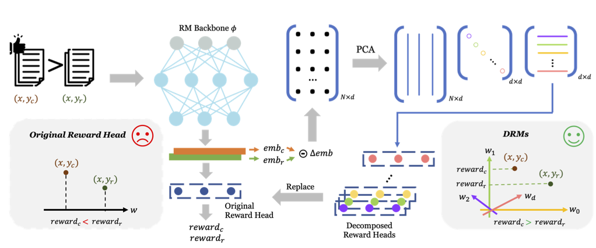

# Rethinking Diverse Human Preference Learning through Principal Component Analysis

Decomposed Reward Models (DRMs) is a novel approach that extracts diverse human preferences from binary comparisons without requiring fine-grained annotations. The framework represent human preferences as vectors and analyze them using PCA. By constructing a dataset of embedding differences between preferred and rejected responses, DRMs identify orthogonal basis vectors that capture distinct aspects of preference. These decomposed rewards can be flexibly combined to align with different user needs, offering an interpretable and scalable alternative to traditional reward models. DRMs can effectively extract meaningful preference dimensions (e.g., helpfulness, safety, humor) and adapt to new users without additional training. 
This repo provides the pipeline to extract embeddings, generate reward heads, and evaluate performance on [RewardBench](https://github.com/allenai/reward-bench) and the `rpr_five_class` dataset.



# Prepare
<!-- - env -->
- Download rewardBench 
  ```bash
  git clone https://github.com/allenai/reward-bench.git
  ```
- Download test set for [rpr_five_class](https://huggingface.co/datasets/amandaa/rpr_five_class/tree/main)
  
# Extract feature embedding
```bash
sh cal_reward_extract_emb.sh
```
# Generate reward heads
```bash
sh generate_head.sh
```
# Evaluate multiple head and TTA
```bash
sh evaluate multiple_head.sh
```
# Citations
If you use this pipeline or `rpr_five_class` dataset in your research, please cite:

```bibtex
@article{luo2025rethinking,
  title={Rethinking diverse human preference learning through principal component analysis},
  author={Luo, Feng and Yang, Rui and Sun, Hao and Deng, Chunyuan and Yao, Jiarui and Shen, Jingyan and Zhang, Huan and Chen, Hanjie},
  journal={arXiv preprint arXiv:2502.13131},
  year={2025}
}
```